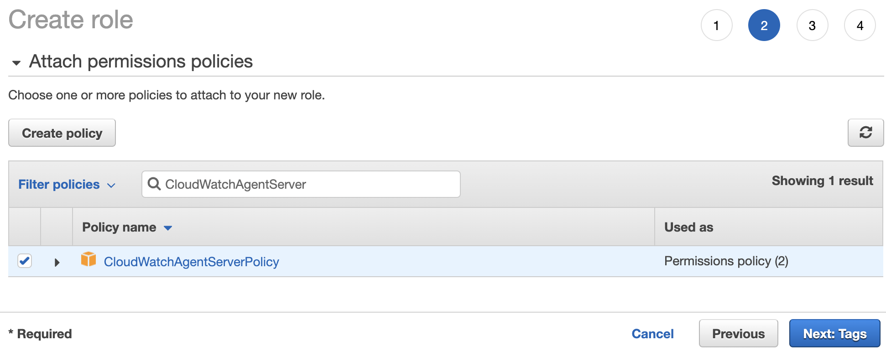
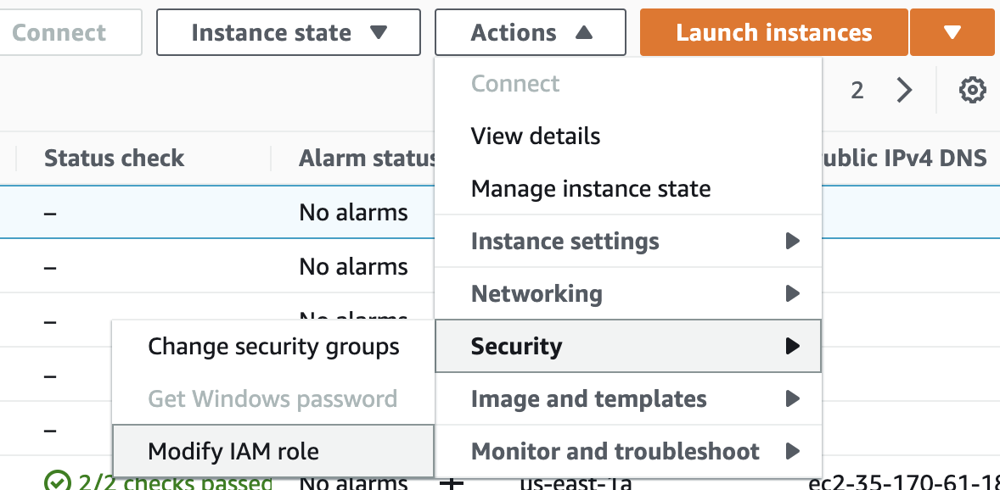
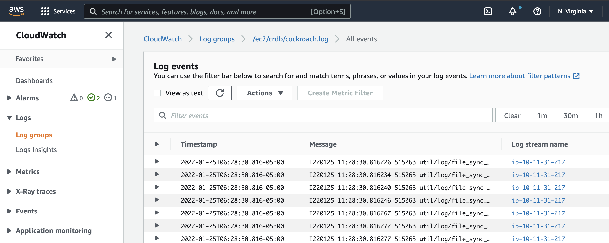

# Setup AWS CloudWatch for CockroachDB

The goal here is to ingest CockroachDB log files into AWS CloudWatch.  Here are the high level steps:
- Install the CloudWatch Agent on CockroachDB Servers
- Assign the CloudWatchAgentServerPolicy IAM policy to the CockroachDB Servers
- Configure the CloudWatch Agent for CockroachDB
- Check the status of the CloudWatch agent
- Verify the logs in CloudWatch LogStream

The following documents assisted with this setup:
- https://docs.aws.amazon.com/AmazonCloudWatch/latest/monitoring/installing-cloudwatch-agent-commandline.html

## Manual Setup

### Install CloudWatch Agent

Run the following steps on each of the CockroachDB nodes

```
sudo apt install unzip
sudo apt install collectd -yq
wget https://s3.amazonaws.com/amazoncloudwatch-agent/linux/amd64/latest/AmazonCloudWatchAgent.zip -O AmazonCloudWatchAgent.zip
unzip AmazonCloudWatchAgent.zip
sudo ./install.sh
```

### Create IAM Role

Don't forget this step!  And it's not hard to do at all.  In the AWS console, go into IAM and create a new role.  Once you have a new role, assign the `CloudWatchAgentServerPolicy` to the role.



Once this is complete, go into EC2 in the AWS Console and assign each of your CockroachDB instances to have this new role.  You have to do this one instance at a time.  If you know of a better way, leave me a comment :)  Select the checkbox next to the instance, click Actions -> Security -> Modify IAM Roles.  Lastly, assign your new role to the instance.



### Configure the CloudWatch Agent for CockroachDB (crdb.json)

Upload or create a `crdb.conf` file on your EC2 CockroachDB servers.  The contents of the crdb.conf file should look like this:

```
{
  "logs": {
    "logs_collected": {
      "files": {
        "collect_list": [
          {
            "file_path": "/home/ubuntu/logs/cockroach-stderr.*.*.log",
            "timestamp_format": "%y%m%d %H:%M:%S.%f",
            "log_group_name": "/ec2/crdb/cockroach-stderr.log",
            "log_stream_name": "{local_hostname}"
          },
          {
            "file_path": "/home/ubuntu/logs/cockroach-pebble.*.*.log",
            "timestamp_format": "%y%m%d %H:%M:%S.%f",
            "log_group_name": "/ec2/crdb/cockroach-pebble.log",
            "log_stream_name": "{local_hostname}"
          },
          {
            "file_path": "/home/ubuntu/logs/cockroach.*.*.log",
            "timestamp_format": "%y%m%d %H:%M:%S.%f",
            "log_group_name": "/ec2/crdb/cockroach.log",
            "log_stream_name": "{local_hostname}"
          }
        ]
      }
    }
  }
}
```

This configuration will only grab 3 log files from cockroachdb: The main CockroachDB log, stderr, and pebble.  CockroachDB has a rich configuration of logging channels that you can find [here](https://www.cockroachlabs.com/docs/v21.2/logging-use-cases.html).  You can augment the crdb.json configuration above with additional log files that you configure for CockroachDB as well.  

Lastly, ensure the `file_path` in the `crdb.json` file correlates to where log files in CockroachDB will land.

If you need to upload the `crdb.json` file, you can use secure copy as shown below:

```bash
scp -pr crdb.conf <user>@<cockroachdb host>:~/crdb.conf
```

Once uploaded, add the Cockroach logging configuration file (crdb.json) to the CloudWatch agent

```bash
sudo /opt/aws/amazon-cloudwatch-agent/bin/amazon-cloudwatch-agent-ctl -a fetch-config -m ec2 -s -c file:/home/ubuntu/crdb.json
```

### Check the CloudWatch Agent Status

Let's ensure the agent is running...

```bash
sudo /opt/aws/amazon-cloudwatch-agent/bin/amazon-cloudwatch-agent-ctl -m ec2 -a status
```

### Verify the logs in CloudWatch LogStream

In the AWS Console, go to the CloudWatch service and select Log Groups from the left navigation.  Search for the name of the "log_group_name" you create in your `crdb.json` configuration file.  You should start seeing those logs stream into the CloudWatch Log Groups service which you can then analyze.




## Roachprod Steps

If you use `roachprod` to deploy your CockroachDB clusters, you can use the following steps as well.

```bash
roachprod create chrisc-test --nodes 3 --clouds aws --aws-zones us-east-2b
roachprod stage chrisc-test release latest
roachprod start chrisc-test
roachprod run chrisc-test -- sudo apt install unzip -yq
roachprod run chrisc-test -- sudo apt install collectd -yq
roachprod run chrisc-test -- wget https://s3.amazonaws.com/amazoncloudwatch-agent/linux/amd64/latest/AmazonCloudWatchAgent.zip -O AmazonCloudWatchAgent.zip
roachprod run chrisc-test -- unzip AmazonCloudWatchAgent.zip
roachprod run chrisc-test -- sudo ./install.sh
roachprod put chrisc-test crdb.json crdb.json
roachprod run chrisc-test -- sudo /opt/aws/amazon-cloudwatch-agent/bin/amazon-cloudwatch-agent-ctl -a fetch-config -m ec2 -s -c file:/home/ubuntu/crdb.json
roachprod run chrisc-test -- sudo /opt/aws/amazon-cloudwatch-agent/bin/amazon-cloudwatch-agent-ctl -m ec2 -a status
