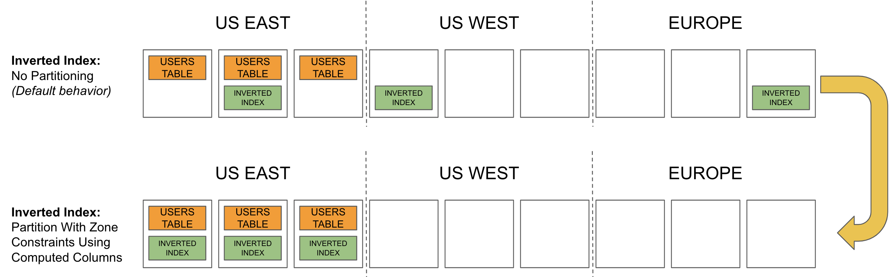

# Part & Pin for the Inverted Index Win

#### How to Partition Inverted Indexes in CockroachDB

Recently I worked with a CockroachDB user who had a GDPR locality requirement.  Naturally CockroachDB was a fit since it sports geo-partitioning capabilities for data and objects.  However, the user ran into a snafu where they could not partition and localize data in inverted indexes.  The example they had was customer data existed in a JSONB data column that had an inverted index on it.  The data in the table was already partitioned by country and pinned to servers / nodes that were in that country.  So they were good with table partitioning and pinning.  But the data in the inverted index could theoretically be distributed anywhere in the cluster and also needed to be partitioned and pinned to the proper locality.  I.e.  A German customer must remain in Germany.  This caught me by surprise as well that you can not partition inverted indexes out of the box with CockroachDB.  In fact, you’ll receive an error message indicating so:

```
pq: inverted indexes don't support partitioning
```

Fortunately there is a workaround!  And a rather simple one as well.  Special thanks to Raphael Poss who helped me think this one through.  The thought here is to use partial compute columns to partition the JSONB column and have it reside in the proper locality using zone constraints.  Essentially, you’re writing some data definition SQL logic to say, "hey column, you should always have JSON data for US East.  So if your row has US East data, then populate yourself with the JSON data.  If not, be null”.  Now that this compute column will only have US East data, so will the inverted index that’s created upon it. The last step is to pin the inverted index to US East.  Make sense?  If not, hopefully this pictorial will help:




Let’s walk thru the steps in how we did this.  We used cockroach demo to quickly show how to do this on a partitioned table in the MOVR sample app.

First, let’s create a geo partitioned replica cluster and turn sql safe updates off for this demonstration.

```sql
cockroach demo --geo-partitioned-replicas
set sql_safe_updates = false;
```

In the [users] table which is already partitioned, let’s add a JSONB column called “custom”.

```sql
alter table users add column custom JSONB;
```

We can easily create an inverted index here...

```sql
create inverted index custom_jsonb on users (custom);
```

But notice that it’s not partitioned nor pinned.  The inverted index is placed across a variety of regions.

```sql_safe_updates
select replica_localities from [show ranges from index users@custom_jsonb];
```

So here is where things are not kosher.  When we try to partition the inverted index we receive an error message that we can’t do this:

```sql
create inverted index custom_jsonb2 on users (city, custom) partition by list (city)
(
PARTITION us_west VALUES IN (('seattle'), ('san francisco'), ('los angeles')),
PARTITION us_east VALUES IN (('new york'), ('boston'), ('washington dc')),
PARTITION europe_west VALUES IN (('amsterdam'), ('paris'), ('rome'))
)
;
```


A bit of a bummer, but there is a workaround….

First, we create compute columns to populate the JSON data based on which locality the data is in.  You should do this for the number of regions you have in your cluster.  In this case, we have 3 regions so we’re creating 3 partial compute columns that use case statements to decide if we should store the JSON data or not.  You can see how each compute column is region specific for US East, US West and Europe.

```sql
alter table users add column custom_west JSONB AS ( case when city IN ('seattle', 'san francisco', 'los angeles') then custom else null end ) STORED;

alter table users add column custom_east JSONB AS ( case when city IN ('new york', 'boston', 'washington dc')  then custom else null end ) STORED;  

alter table users add column custom_euro JSONB AS ( case when city IN ('amsterdam', 'paris', 'rome') then custom else null end ) STORED;
```


Second, we create an inverted index for each of the new compute columns.  Notice how each inverted index is region specific.

```sql
create inverted index indx_custom_west on users (custom_west);
create inverted index indx_custom_east on users (custom_east);
create inverted index indx_custom_euro on users (custom_euro);
```

Last but not least, let’s pin the inverted indexes to the proper locality / region.

```sql
alter index users@indx_custom_west configure zone using constraints = '{"+region=us-west1"}',  num_replicas = 3;
alter index users@indx_custom_east configure zone using constraints = '{"+region=us-east1"}',  num_replicas = 3;
alter index users@indx_custom_euro configure zone using constraints = '{"+region=europe-west1"}',  num_replicas = 3;
```

You can verify that the ddl was created appropriately for the columns, indexes and partitions.

```sql
show create users;
```

And most importantly, let’s validate that the inverted indexes are pinned to the right regions:

```sql
select 'US West', replica_localities from [show ranges from index users@indx_custom_west];
select 'US East', replica_localities from [show ranges from index users@indx_custom_east];
select 'Europe', replica_localities from [show ranges from index users@indx_custom_euro];
```


It may take a few seconds for the schema changes to take affect so you may have to re-run the last statement to see the correct results.  As you can see, we have the inverted indexes pinned to the correct regions to be GDPR compliant.  This is a great maneuver.  It reminds of how Maverick did the 4G inverted dive with a Mig 28.
