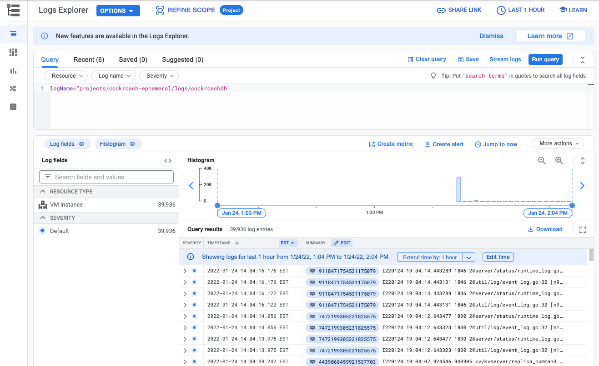

# Setup Google StackDriver for CockroachDB

The following steps install and configure StackDriver for a self hosted deployment of CockroachDB.
- Install the agent on CockroachDB VMs
- Configure agent to point to CockroachDB logs
- Restart agent
- Verify logs in StackDriver

A majority of these steps can be found in Google Docs: https://cloud.google.com/logging/docs/agent/logging/installation

## Manual Setup

### Install the agent on CockroachDB VMs

```bash
curl -sSO https://dl.google.com/cloudagents/add-logging-agent-repo.sh
sudo bash add-logging-agent-repo.sh --also-install
```

## Configure agent to point to CockroachDB logs

Create `cockroachdb.conf` file with the following contents:

```
<source>
  @type tail
  format none
  path /home/ubuntu/logs/*.log
  pos_file /var/lib/google-fluentd/pos/cockroachdb.pos
  read_from_head true
  tag cockroachdb
</source>
```


Look in `cockroachdb.conf` and confirm the logging directory where CockroachDB is landing the log files

```
...
path /home/ubuntu/logs/*.log
...
```

Put `cockroachdb.conf` config in fluentd config folder

```bash
scp -pr cockroachdb.conf <user>@<gce host>/etc/google-fluentd/config.d/cockroachdb.conf
```
Depending on your permissions, you may have to copy to your home folder first and then sudo cp in the config.d directory

## Restart agent

```bash
sudo service google-fluentd force-reload
```

## Check status
```bash
sudo service google-fluentd status
```

The output should look like this:

```
1: ● google-fluentd.service - LSB: data collector for Treasure Data
Loaded: loaded (/etc/init.d/google-fluentd; bad; vendor preset: enabled)
Active: active (running) since Mon 2022-01-24 18:41:59 UTC; 2min 44s ago
...
```

## Verify Logs in StackDriver



# Roachprod Steps

If you would like to automate the setup using roachprod, the following script should set this us for your entire cluster.

```
roachprod run chrisc-ihg-gce -- curl -sSO https://dl.google.com/cloudagents/add-logging-agent-repo.sh
roachprod run chrisc-ihg-gce -- sudo bash add-logging-agent-repo.sh --also-install
roachprod put chrisc-ihg-gce -- cockroachdb.conf cockroachdb.conf
roachprod run chrisc-ihg-gce -- sudo cp cockroachdb.conf /etc/google-fluentd/config.d/cockroachdb.conf
roachprod run chrisc-ihg-gce -- sudo service google-fluentd force-reload
roachprod run chrisc-ihg-gce -- sudo service google-fluentd status
```

#### Miscellaneous Materials
- CRDB logging blog: https://www.cockroachlabs.com/blog/centralized-logging-for-cockroachdb/